# VOICEVOX ロボット発話システム — 設計書

| 項目 | 内容 |
|------|------|
| バージョン | 1.0 |
| 作成日 | 2026-06-28 |
| 対象ブランチ | main |

---

## 1. 目的・背景

VOICEVOX を用いた音声合成を PC 上で行い、合成した音声を ROS2 ネットワーク経由でロボットのスピーカーから再生するシステム。

- **音声合成**は計算コストが高いため PC 側に集約する
- **音声再生**はロボット側で行い、どのロボットでも `player_node` を起動するだけで対応できる汎用設計とする
- Web UI・ROS2 CLI の両方から発話をトリガーできる

---

## 2. システム全体構成

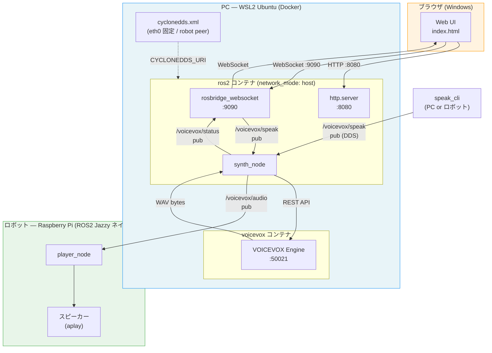

---

## 3. ネットワーク・デプロイ設計

### 3.1 ポート・プロトコル一覧

| ポート | プロトコル | 用途 |
|--------|-----------|------|
| 8080 | HTTP | Web UI 静的ファイル配信 |
| 9090 | WebSocket | rosbridge（ブラウザ ↔ ROS2） |
| 50021 | HTTP | VOICEVOX Engine REST API |
| — | UDP Multicast/Unicast | ROS2 DDS (CycloneDDS) |

### 3.2 WSL2 ネットワーク構成

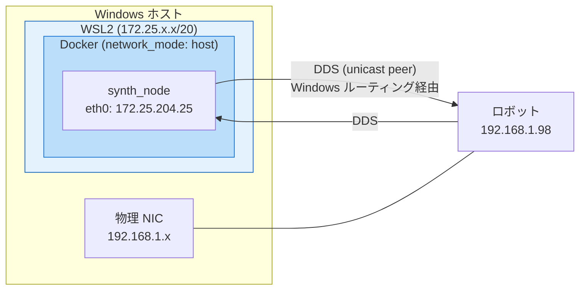

> WSL2 の eth0 は LAN（192.168.1.x）と異なるサブネット（172.25.x.x）に存在する。
> `cyclonedds.xml` でロボットの IP を peer に明示することで CycloneDDS の到達性を確保する。

### 3.3 CycloneDDS 設定 (`cyclonedds.xml`)

```xml
<CycloneDDS>
  <Domain>
    <General>
      <Interfaces>
        <NetworkInterface name="eth0" multicast="true"/>
      </Interfaces>
    </General>
    <Discovery>
      <Peers>
        <Peer address="<ロボットIP>"/>
      </Peers>
    </Discovery>
  </Domain>
</CycloneDDS>
```

---

## 4. ROS2 トピック設計

### 4.1 トピック一覧

| トピック名 | 型 | 方向 | QoS Depth | 説明 |
|-----------|-----|------|-----------|------|
| `/voicevox/speak` | `std_msgs/String` | 発話元 → synth_node | 10 | 発話リクエスト (JSON) |
| `/voicevox/audio` | `std_msgs/UInt8MultiArray` | synth_node → player_node | 10 | 合成済み WAV バイト列 |
| `/voicevox/status` | `std_msgs/String` | synth_node → ブラウザ | 10 | 状態通知 (JSON) |

### 4.2 メッセージスキーマ

**`/voicevox/speak`（発話リクエスト）**

```json
{
  "text": "こんにちは",
  "speaker_id": 2,
  "speed": 1.0,
  "volume": 1.0
}
```

| フィールド | 型 | デフォルト | 説明 |
|-----------|-----|-----------|------|
| `text` | string | 必須 | 発話テキスト |
| `speaker_id` | int | 2 | VOICEVOX 話者 ID（四国めたん ノーマル） |
| `speed` | float | 1.0 | 速度（0.5 〜 2.0） |
| `volume` | float | 1.0 | 音量（0.0 〜 2.0） |

**`/voicevox/status`（状態通知）**

```json
{
  "state": "speaking",
  "message": "発話中: こんにちは"
}
```

| `state` 値 | 意味 |
|-----------|------|
| `idle` | 待機中 |
| `speaking` | 発話中 |
| `error` | エラー（VOICEVOX 接続失敗など） |

---

## 5. ノード詳細設計

### 5.1 synth_node

**役割**: 発話リクエストを受け取り、VOICEVOX で音声合成して WAV バイト列を配信する

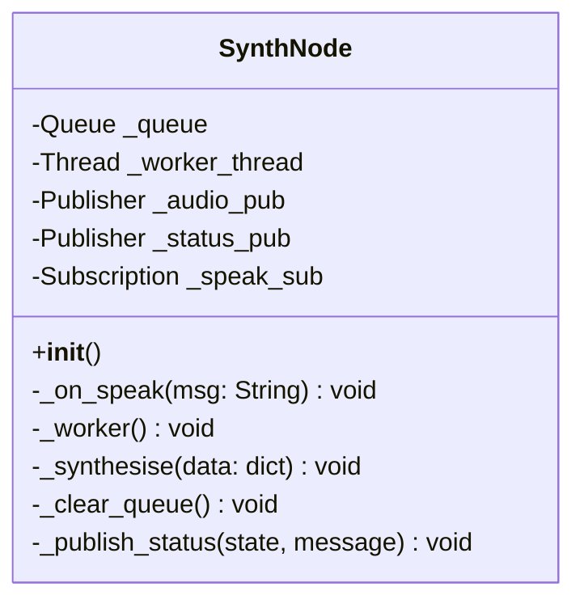

**処理フロー**

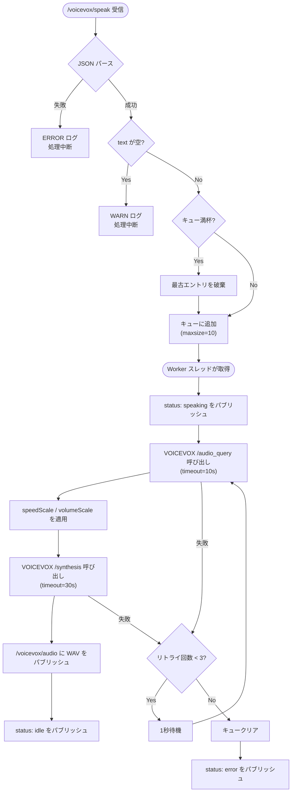

**環境変数**

| 変数名 | デフォルト | 説明 |
|--------|-----------|------|
| `VOICEVOX_URL` | `http://localhost:50021` | VOICEVOX Engine の URL |

**定数**

| 定数 | 値 | 説明 |
|------|-----|------|
| `MAX_QUEUE_SIZE` | 10 | キュー最大長 |
| `MAX_RETRIES` | 3 | リトライ上限回数 |
| `RETRY_INTERVAL` | 1.0s | リトライ間隔 |

---

### 5.2 player_node

**役割**: `/voicevox/audio` を受信し、`aplay` でロボットスピーカーに再生する

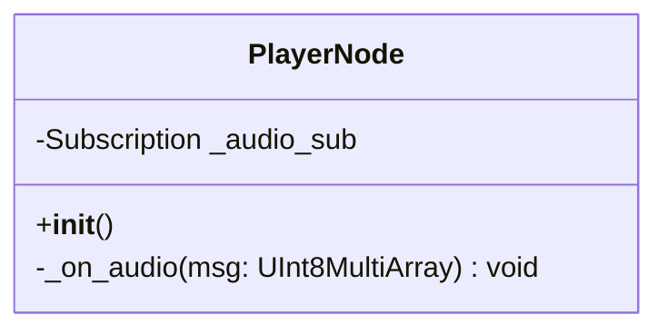

**処理フロー**

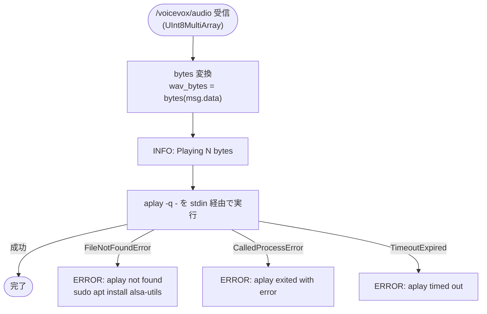

---

### 5.3 speak_cli

**役割**: コマンドライン引数からワンショットで `/voicevox/speak` に発話リクエストを送る

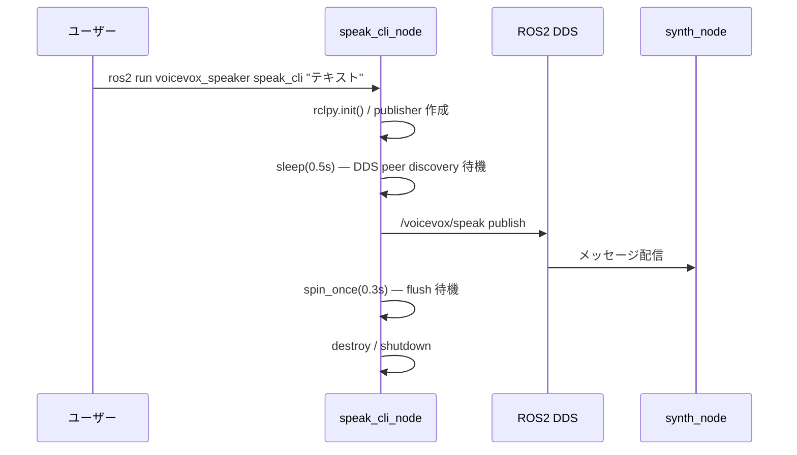

**CLI 引数**

| 引数 | 型 | デフォルト | 説明 |
|------|-----|-----------|------|
| `text` | positional | 必須 | 発話テキスト |
| `--speaker-id` | int | 2 | 話者 ID |
| `--speed` | float | 1.0 | 速度（0.5〜2.0） |
| `--volume` | float | 1.0 | 音量（0.0〜2.0） |

---

## 6. エンドツーエンド シーケンス

### 6.1 Web UI からの発話

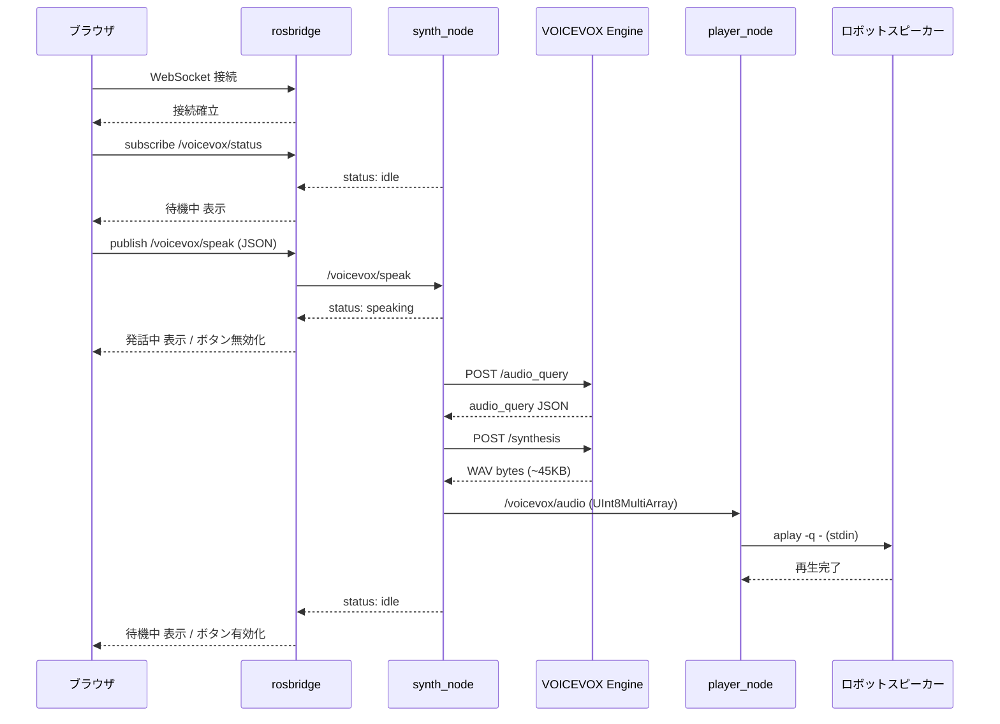

### 6.2 ROS2 CLI からの発話（ロボット側 speak_cli）

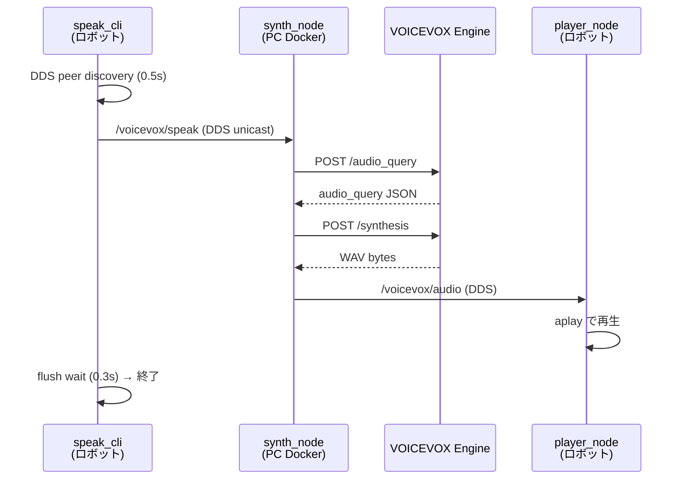

### 6.3 エラーリトライシーケンス

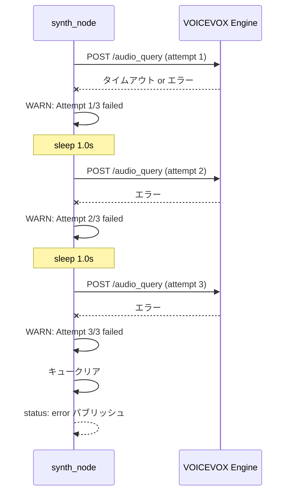

---

## 7. コンポーネント間の依存関係

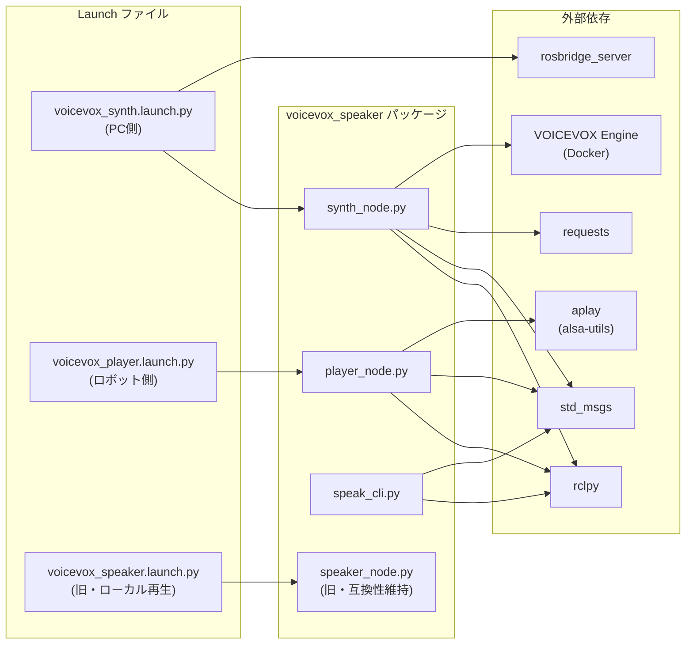

---

## 8. ファイル構成

```
voicevox_ros2_jazzy/
├── Dockerfile                          # ros2 コンテナ定義（tiryoh/ros2:jazzy ベース）
├── docker-compose.yml                  # VOICEVOX + ros2 コンテナ起動定義
├── docker-entrypoint.sh                # コンテナ起動スクリプト（voicevox_synth.launch.py）
├── cyclonedds.xml                      # CycloneDDS NIC・peer 設定（ロボットIP要編集）
├── README.md
├── docs/
│   └── specs/
│       ├── system_design.md            # 本設計書
│       └── voicevox_web_speaker.md     # 旧要件定義書
└── src/voicevox_speaker/
    ├── package.xml
    ├── setup.py
    ├── setup.cfg
    ├── requirements.txt
    ├── resource/voicevox_speaker
    ├── voicevox_speaker/
    │   ├── __init__.py
    │   ├── synth_node.py               # PC側: 音声合成 → /voicevox/audio
    │   ├── player_node.py              # ロボット側: /voicevox/audio → aplay
    │   ├── speak_cli.py                # CLI発話ツール
    │   └── speaker_node.py            # 旧: PCローカル再生（互換性維持）
    ├── launch/
    │   ├── voicevox_synth.launch.py    # PC側: rosbridge + synth_node + Web UI
    │   ├── voicevox_player.launch.py   # ロボット側: player_node
    │   └── voicevox_speaker.launch.py  # 旧: PCローカル再生
    ├── web/
    │   ├── index.html                  # Web UI（roslibjs 使用）
    │   └── roslib.min.js               # roslibjs ローカルバンドル
    └── test/
        ├── conftest.py
        └── test_speaker_logic.py
```

---

## 9. 環境変数・設定一覧

| 変数名 | 設定場所 | デフォルト | 説明 |
|--------|---------|-----------|------|
| `ROS_DOMAIN_ID` | docker-compose.yml / ロボット | 0 | DDS ドメイン（PC・ロボット共通） |
| `RMW_IMPLEMENTATION` | docker-entrypoint.sh / ロボット | — | `rmw_cyclonedds_cpp` 固定 |
| `VOICEVOX_URL` | docker-compose.yml | `http://localhost:50021` | VOICEVOX Engine URL |
| `CYCLONEDDS_URI` | docker-compose.yml | — | `file:///etc/cyclonedds.xml` |

---

## 10. 非機能要件・制約

| 項目 | 内容 |
|------|------|
| 発話キュー上限 | 10 件（超過時は最古を破棄） |
| VOICEVOX リトライ | 最大 3 回、間隔 1 秒 |
| 音声合成タイムアウト | `/audio_query`: 10 秒、`/synthesis`: 30 秒 |
| 音声再生タイムアウト | 60 秒 |
| 同時発話 | 非対応（キューで順次処理） |
| 認証・アクセス制限 | なし（LAN 内デモ用途） |
| ホスト WSL2 への ROS2 インストール | 不要（Docker コンテナ完結） |
